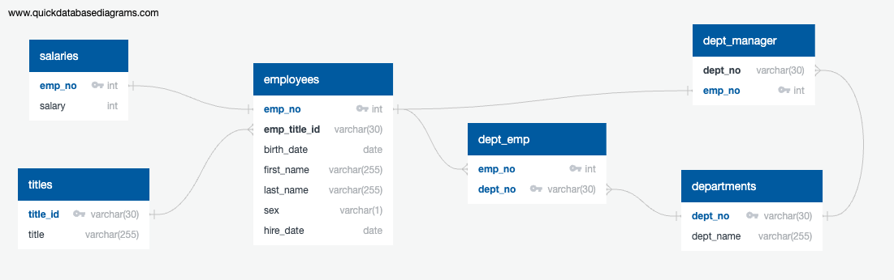

# SQL Analysis of Employee Data
This repository includes an analysis of historical employee data. All code is stored in the EmployeeSQL directory. Within this directory you will find a schemata.sql file which contains the SQL code required to create a PostgreSQL schema for data analysis. This schema includes six tables. The Employee csv includes core employee data including an employee number, name information, birth date, hire date, sex, and keys to additional tables. The departments CSV includes department ID's and names. The dept_emp CSV includes information to allow an employee to be linked to his/her department or departments (an employee can be a member of more than one department). The dept_manager CSV includes information on who manages each department. Note that any given department may have more than one manager. The salaries CSV linkes an employee record to their salary using employee number. Finally, the titles CSV provides the various job titles that an employee might have, linked to the employee record by a title_id  All CSV's are stored in the 'data' subdirectory within the 'EmployeeSQL' directory. 

In order to perform the analysis, CSV's were imported into a PostgreSQL database with the CSV names corresponding to the table names, one table for each CSV. They were imported in the order of:

* Departments
* Titles
* Employees
* Salaries
* dept_manager
* dept_emp

This avoids conflicts with foreign keys. Note that all tables have a single column that acts as a primary key aside from the dept_emp table which has a composite key since it is acting as a junction table rather than containing any information of its own.

Finally, there are seven separate SQL queries contained in the file questions.sql in the EmployeeSQL directory that constitute the analysis section of the database. The queries answer the questions:
* List the employee number, last name, first name, sex, and salary of each employee.
* List the first name, last name, and hire date for the employees who were hired in 1986.
* List the manager of each department along with their department number, department name, employee number, last name, and first name.
* List the department number for each employee along with that employee’s employee number, last name, first name, and department name.
* List first name, last name, and sex of each employee whose first name is Hercules and whose last name begins with the letter B.
* List each employee in the Sales department, including their employee number, last name, and first name.
* List each employee in the Sales and Development departments, including their employee number, last name, first name, and department name.
* List the frequency counts, in descending order, of all the employee last names (that is, how many employees share each last name).

## Credit for Outside Parties and Apps
The Quick DBD app that can be found at https://app.quickdatabasediagrams.com was used to generate the schemata file rather than manual creation of the sql code. Quick DBD was also used to generate an ERD.png file that displays the overall database design as shown below.

